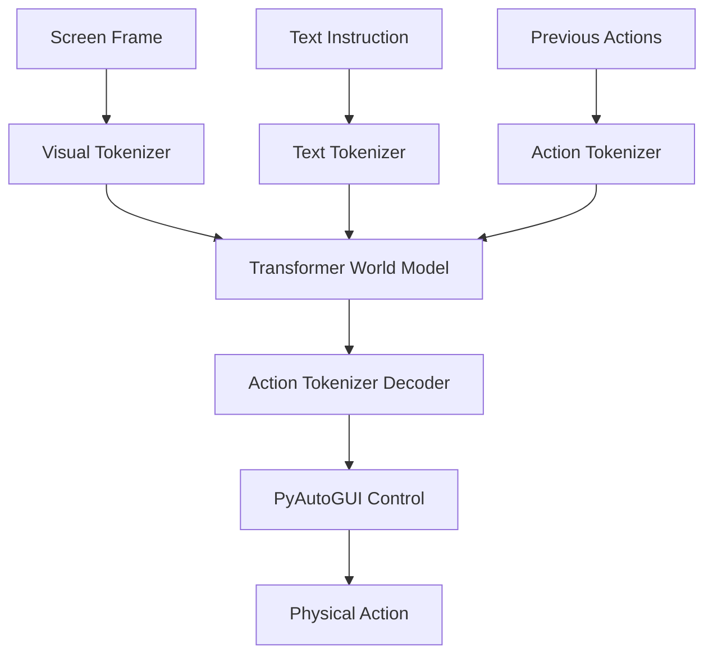

# 🧠 MARROW: Multimodal Autonomous Responsive Robotic Operating World

[](https://opensource.org/licenses/MIT)
[](https://www.python.org/downloads/release/python-390/)
[](https://developer.apple.com/metal/pytorch/)

**MARROW** is a high-performance, autonomous VLA (Vision-Language-Action) agent designed to observe, learn, and execute complex workflows on macOS. Unlike traditional automation, MARROW uses a Transformer-based World Model to "dream" the next action based on visual pixels and natural language instructions.

---

## ✨ Core Pillars

### 👁️ Discrete Vision (FSQ)
Uses a Convolutional Autoencoder with **Finite Scalar Quantization (FSQ)** to tokenize raw screen frames into a discrete visual vocabulary. This allows the model to "read" the screen as a sequence of symbols rather than raw pixels.

### 🎭 Autoregressive World Model
A custom **Transformer-based World Model** that predicts the next sequence of mouse and keyboard actions. It features temporal memory, enabling the agent to maintain continuity across multi-step tasks.

### 🎙️ Multimodal Orchestration
Concurrently collects **Screen, Audio (Whisper Transcriptions), and Accessibility Metadata** to build a rich, contextual dataset of human-computer interaction.

### 🎯 Goal-Conditioned Execution
Conditioned on character-level encoded instructions, allowing for "Look -> Think -> Act" loops driven by your physical intent.

---

## 🏗️ Architecture



---

## 🚀 Quick Start

### 1. Installation
```bash
git clone https://github.com/YourUsername/MARROW.git
cd MARROW
pip install -r requirements.txt
```

### 2. Data Collection (The "Sprint")
Record your own behavior to teach the agent:
```bash
python3 -m eidos.engine
```

### 3. Training the Brain
Train the World Model on your captured observations:
```bash
python3 -m eidos.trainer.train_world
```

### 4. Autonomous Execution
Launch the agent and give it an instruction:
```bash
python3 -m eidos.agent
```

---

## 🛠️ Tech Stack

- **Engine**: PyTorch (MPS Accelerated)
- **Computer Vision**: OpenCV, MSS, PIL
- **Speech-to-Text**: OpenAI Whisper
- **Automation**: PyAutoGUI, Pynput
- **Storage**: SQLite3

---

## 🚧 Roadmap

- [x] FSQ Visual Tokenization
- [x] Multi-frame Temporal History
- [x] Dynamic Resolution Adaptation
- [ ] Multi-Modal Audio Instruction Tuning
- [ ] Reinforcement Learning from Human Feedback (RLHF)

---

## ⚖️ Safety & Fail-Safe
MARROW is designed with **Safety First**. 
- **Physical Fail-Safe**: Slamming the mouse to any corner of the screen instantly aborts the agent.
- **Fail-Safe Mode**: `pyautogui.FAILSAFE = True` is hardcoded into the core engine.

---

## 📜 License
MARROW is released under the **MIT License**. Build the future of autonomous computing responsibly.

---
*Created with ❤️ by the MARROW Development Team.*
