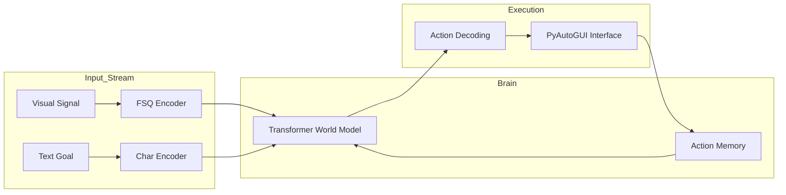

# MARROW: Agentic World Models for Autonomous HCI

**MARROW** (Multimodal Autonomous Responsive Robotic Operating World) is an experimental Vision-Language-Action (VLA) agent designed for high-fidelity human-computer interaction synthesis. It leverages a custom Transformer-based World Model to autonomously execute OS-level workflows on macOS by mapping high-dimensional visual observations to discrete action sequences.

---

## 🔬 Technical Overview

MARROW addresses the challenge of sequence modeling in non-stationary environments. By discretizing the visual space and normalizing the action manifold, the system treats computer interaction as a token-prediction problem, analogous to Large Language Models (LLMs) but operating on a multimodal input stream.

### 1. Neural Visual Tokenization (FSQ-Autoencoder)
The system employs a Convolutional Autoencoder with **Finite Scalar Quantization (FSQ)** to map raw 256x160 RGB frames into a 500-dimensional latent space. 
- **Advantage over VQ-VAE**: FSQ avoids the common pitfalls of codebook collapse and the need for complex EMA/Commitment losses by using a fixed, predefined quantization grid.
- **Mapping**: Each frame is decomposed into a grid of quantized latent vectors, forming the visual prefix for the world model.

### 2. Causal Transformer World Model
At the core of MARROW is a **Causal Decoder-Only Transformer** (6 layers, 8 heads, 256-dim embedding) responsible for autoregressive action synthesis.
- **Goal-Conditioning**: Natural language instructions are character-level encoded and prepended to the visual tokens, creating a goal-conditioned manifold.
- **Autoregressive Inference**: The model predicts a 5-token action packet `[app, mouse_pos, click, key, special]` per step, conditioned on the previous 1024 tokens of context.

### 3. Asynchronous Multimodal Orchestration
To maintain 0.5Hz - 1Hz sampling frequency, MARROW utilizes a multi-threaded data collection engine:
- **Screen**: High-speed frame capture via `mss`.
- **Audio**: Real-time transcription using OpenAI’s **Whisper** (Tiny) for vocal instruction alignment.
- **Accessibility**: Real-time extraction of macOS Accessibility API metadata for enhanced semantic labeling during training.

---

## 🚀 Engineering Challenges & Solutions

### 🛡️ Solving Token Collision
In early development, visual tokens and action tokens overlapped in the 0-10 range, causing the model to interpret visual patterns as "Stay Still" commands. We implemented a **global token-offset architecture**:
- **Actions**: `[0 - 2000]`
- **Instructions**: `[5000 - 5300]`
- **Visuals**: `[6000 - 10000]`
- **Separators**: `[10000 - 10001]`

### 🧠 Temporal Coherence Buffer
Implemented a **deque-based history buffer** in the inference engine to provide the model with a 2-frame temporal window. This stabilizes the hidden state of the Transformer, preventing state-fluctuation and erratic mouse movements common in memoryless VLA agents.

### ⚡ Hardware Optimization
The entire pipeline is optimized for **Apple Silicon (M-series)**, utilizing the `Metal Performance Shaders (MPS)` backend for accelerated tensor operations and low-latency inference.

---

## 🛠️ System Architecture



---

## 🏃 Execution Manual

### Environment Setup
```bash
# Optimized for Python 3.9+
pip install -r requirements.txt
```

### The Workflow
1. **Data Acquisition**: `python3 -m eidos.engine` (Records raw multimodal sessions into SQLite3).
2. **Brain Synthesis**: `python3 -m eidos.trainer.train_world` (Trains the Transformer on sequential observation-action pairs).
3. **Autonomous Inference**: `python3 -m eidos.agent` (Load-test the agent with live goal-conditioning).

---

## 📈 Future Research Directions
- [ ] Adaptive Reward Shaping for RL-based fine-tuning.
- [ ] Multi-Modal Instruction Alignment using CLIP-based visual encoders.
- [ ] Low-rank Adaptation (LoRA) for personalized user-behavior modeling.

---
**Author**: [Your Name/Shylin26]  
**Technology Interests**: Computer Vision, Transformer Architectures, Autonomous Systems.
